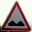

# Traffic Sign Recognition Classifier

---

## Overview
This project is part of the [Udacity's Self Driving Car Nanodegree](https://www.udacity.com/course/self-driving-car-engineer-nanodegree--nd013). 

A model will be designed, trained, and validated so it can classify traffic sign images using the [German Traffic Sign Dataset](http://benchmark.ini.rub.de/?section=gtsrb&subsection=dataset).

After training the model, it will be tried out on images of German traffic signs randomly selected on the web.

---

## Goals

The goals/steps of this project are the following:

1. Load the data set from [here](https://s3-us-west-1.amazonaws.com/udacity-selfdrivingcar/traffic-signs-data.zip).
2. Explore, summarize and visualize the data set
3. Design, train and test a model architecture
4. Use the model to make predictions on new images
5. Analyze the softmax probabilities of the new images
6. Summarize the results with a written report


[//]: # (Image References)

[image1]: ./examples/visualization.jpg "Visualization"
[image2]: ./examples/grayscale.jpg "Grayscaling"
[image3]: ./examples/random_noise.jpg "Random Noise"
[image4]: ./examples/placeholder.png "Traffic Sign 1"
[image5]: ./examples/placeholder.png "Traffic Sign 2"
[image6]: ./examples/placeholder.png "Traffic Sign 3"
[image7]: ./examples/placeholder.png "Traffic Sign 4"
[image8]: ./examples/placeholder.png "Traffic Sign 5"

---

## Data Set Summary & Exploration

The German Traffic Sign Dataset is composed of 51839 images, belonging each one to 1 of 43 different categories. 


The dataset is split into training, validation and testing subsets:

| Subset     | # samples |
|------------|-----------|
| Training   |     34799 |
| Validation |      4410 |
| Testing    |     12630 |

The 43 image categories are labeled as follows:

| Label   | Sign name                                          | 
|---------|----------------------------------------------------| 
| 0       | Speed limit (20km/h)                               | 
| 1       | Speed limit (30km/h)                               | 
| 2       | Speed limit (50km/h)                               | 
| 3       | Speed limit (60km/h)                               | 
| 4       | Speed limit (70km/h)                               | 
| 5       | Speed limit (80km/h)                               | 
| 6       | End of speed limit (80km/h)                        | 
| 7       | Speed limit (100km/h)                              | 
| 8       | Speed limit (120km/h)                              | 
| 9       | No passing                                         | 
| 10      | No passing for vehicles over 3.5 metric tons       | 
| 11      | Right-of-way at the next intersection              | 
| 12      | Priority road                                      | 
| 13      | Yield                                              | 
| 14      | Stop                                               | 
| 15      | No vehicles                                        | 
| 16      | Vehicles over 3.5 metric tons prohibited           | 
| 17      | No entry                                           | 
| 18      | General caution                                    | 
| 19      | Dangerous curve to the left                        | 
| 20      | Dangerous curve to the right                       | 
| 21      | Double curve                                       | 
| 22      | Bumpy road                                         | 
| 23      | Slippery road                                      | 
| 24      | Road narrows on the right                          | 
| 25      | Road work                                          | 
| 26      | Traffic signals                                    | 
| 27      | Pedestrians                                        | 
| 28      | Children crossing                                  | 
| 29      | Bicycles crossing                                  | 
| 30      | Beware of ice/snow                                 | 
| 31      | Wild animals crossing                              | 
| 32      | End of all speed and passing limits                | 
| 33      | Turn right ahead                                   | 
| 34      | Turn left ahead                                    | 
| 35      | Ahead only                                         | 
| 36      | Go straight or right                               | 
| 37      | Go straight or left                                | 
| 38      | Keep right                                         | 
| 39      | Keep left                                          | 
| 40      | Roundabout mandatory                               | 
| 41      | End of no passing                                  | 
| 42      | End of no passing by vehicles over 3.5 metric tons | 


To obtain these metrics, the following code snippet has been used:

```python

n_train = len(X_train)
n_validation = len(X_valid)
n_test = len(X_test)
image_shape = X_train[0].shape
n_classes = len(List['SignName'])

print("Number of training examples =", n_train)
print("Number of validation examples =", n_validation)
print("Number of testing examples =", n_test)
print("Image data shape =", image_shape)
print("Number of classes =", n_classes)

```

In the pictures below, it can be observed that the training, validation and testing datasets have a similar _number of examples per label_ distribution, regardless of the _number of samples per label_ is not evenly distributed across each dataset.


---

## Design and Test a Model Architecture

The LeNet-5 network will be used as a basis for this project's solution.

Nevertheless, several changes will be performed to make the network a bit more performant on this dataset.

### Pre-process the Data Set

Dataset has been pre-processed in following ways:
1. Image translation
2. Image rotation
3. Image afination
4. Image brightness
5. Image greyscale

After this, data has been augmented. Below is the data visualization after data augmentation.


### Model Architecture

My final model is based on the [LeNet](http://yann.lecun.com/exdb/lenet/) architecture:


I have modified it to:
   - Accept RGB images of 32x32 instead of grayscale images of 28x28.
   - Classify 43 images instead of 10.
   - Increase accuracy on this dataset.

In order to increase its accuracy, I have performed the following changes:
   - Change the second [max_pool](https://www.tensorflow.org/api_docs/python/tf/nn/max_pool) layer by an [avg_pool](https://www.tensorflow.org/api_docs/python/tf/nn/avg_pool) layer.
   - Add [dropout](https://en.wikipedia.org/wiki/Dropout_(neural_networks)) to reduce [overfitting](https://en.wikipedia.org/wiki/Overfitting).
   - Use 5 fully connected layers instead of 3.

This is my final model architecture:

| Layer         		|     Description	        					| 
|:---------------------:|:---------------------------------------------:| 
| Input         		| 32x32x3 RGB image   							| 
| Convolutional       	| Input = 32x32x3. Output = 28x28x6.        	|
| Relu      			|												|
| Max pooling	      	| 2x2 stride,  outputs 14x14x6   				|
| Convolutional    	    | Input = 14x14x6. Output = 10x10x16.           |
| Relu		            |         									    |
| Avg pooling	      	| 2x2 stride, outputs 5x5x16 			    	|
| Flatten				| Input = 5x5x16. Output = 400.					|
| Fully connected	    | Input = 400. Output = 120. 					|
| Relu		            |         									    |
| Dropout   		    | 0.8     									    |
| Fully connected	    | Input = 120. Output = 84. 					|
| Relu		            |         									    |
| Fully connected	    | Input = 84. Output = 43.   					|


### Model training
During the training step, the [Adam optimizer](https://machinelearningmastery.com/adam-optimization-algorithm-for-deep-learning/) is used to try to minimize the [loss](https://en.wikipedia.org/wiki/Loss_function). Loss is calculated by reducing the mean of the [cross entropy](https://en.wikipedia.org/wiki/Cross_entropy) function, which uses the [Softmax function](https://en.wikipedia.org/wiki/Softmax_function) to predict the output between the different 43 categories.

The following hyperparameters have been tuned to improve the model accuracy:
* [learning rate](https://towardsdatascience.com/understanding-learning-rates-and-how-it-improves-performance-in-deep-learning-d0d4059c1c10)
* [epochs](http://www.fon.hum.uva.nl/praat/manual/epoch.html)
* [batch size](https://radiopaedia.org/articles/batch-size-machine-learning)

### Model results

My final model returned a 98.9% accuracy on the training set, and a 94.2% accuracy on the validation set.

These were the steps I followed to get the results above:

* I first trained the _original_ LeNet architecture with a learning rate of 0.1, a batch size of 128 and a number of epochs of 10.
* Then I started playing different combinations of epochs, batch_size and learning rate.
  * I increased the epochs from 20 to 50, being 50 the best performant.
  * I decreased the learning rate from 0.1 to 0.001, trying 0.01, 0.005 and 0.002. 0.001 was the most performant in term of accuracy.
  *  Decreased the batch size from 128 to 64, which was the selected batch size because it was the most performant in terms of accuracy.
* With the changes above I obtained an increase of the accuracy of around 0.3.
* Then I started adding fully connected layers and dropout until getting the final solution.
* Please notice that the second max_pool layer from the original LeNet architecture has been replaced by an avg_pool layer. It does not increase significantly the accuracy (around 0.1), but it adds up. I also thought it was a beautiful change, so I decided to keep it.

### Test a Model on New Images


Here are eight German traffic signs that I found on the web:





Please notice that each of the images had a different size. They were rescaled programmatically when loaded.


Here are the results of the prediction:

| Image			                 |     Prediction	        					       | 
|:------------------------------:|:---------------------------------------------------:| 
| Keep Left          		     | Keep Left                                           | 
| Go straight or left       	 | Go straight or left    			                   |
| Bumpy road	                 | Bumpy road						            	   |
| No entry	                     | No entry				            		      	   |
| No vehicles	                 | End of no passing					               |
| General caution	             | General caution					            	   |
| Speed limit (30km/h)		     | Speed limit (30km/h)		 	        			   |
| Speed limit (70km/h)     		 | Road work                                           |


The model was able to correctly guess 6 of the 8 traffic signs, which gives an accuracy of 75%. 

I really hope you have enjoyed reading this project as much I have done writing it for you.

Pushkar Mehendale